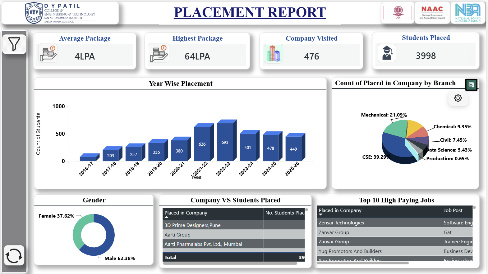

# DYPCET Student Placement Analytics Dashboard 📊

## Overview
An interactive Power BI dashboard developed to analyze student placement trends, company participation, package distribution, and placement performance.

## Key Highlights
- Students Placed: 3998
- Companies Visited: 476
- Highest Package: 64 LPA
- Average Package: 4 LPA

## Tools Used
- Microsoft Power BI
- DAX
- Power Query
- Microsoft Excel

## Dashboard Preview

## Author
Shivam Patil
